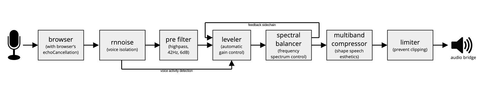
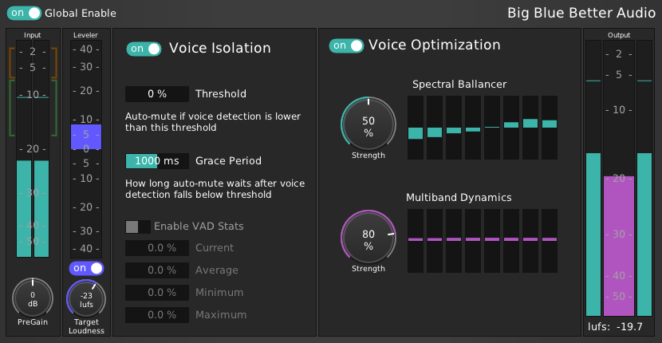

# BigBlueBetterAudio

Better Audio for [BigBlueButton](https://bigbluebutton.org/)!

## BigBlueButton

[BigBlueButton](https://bigbluebutton.org/) is one of the most popular free and open-source video conferencing systems. It is widely used in education settings, by NGOs, government and business units.

## Audio Aesthetics

Technical aspects such as error-free capture and transmission are essential for achieving high audio quality, but the aesthetic side of the listening experience is often overlooked. 

Well-processed audio makes voices sound more natural, engaging, and pleasant, which reduces listener fatigue, supports concentration, and enhances overall communication. Aesthetic enhancements help create a more immersive and overall enjoyable environment, which is especially valuable in collaborative work and education settings.

## The Audio Process

Drawing on over 20 years of audio engineering experience in mixing and mastering, I have developed an audio DSP process that focuses on enhancing perceived audio aesthetics of recorded speech in real-time. 

While technically pristine audio remains the foundation, a chain of carefully tuned conventional audio processes combined with newly designed autonomous audio effects and rnnoise voice isolation add a powerful aesthetic dimension to the listening experience.

## Audio Flow

## Injection

As shown in the audio flow diagram, BBBA's audio processing runs in the user's browser and does not require additional server capacity.

BBBA's DSP is written in Faust and compiled to a wasm module via DPF and emscripten. The wasm module runs as an audio worklet inside BBB's html5 client.

## Screenshot

When using the desktop plugin version, BBBA will look like this:

## Support and Funding
With support and funding from the PrototypeFund (class 01, June-November 2025).

