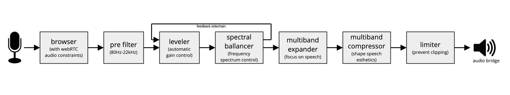

# BigBlueBetterAudio
Better Audio for [BigBlueButton](https://bigbluebutton.org/)!

## BigBlueButton
[BigBlueButton](https://bigbluebutton.org/) is one of the most popular free and open source video conferencing systems. It is widely used in education, by NGOs, government and business.

## Audio Esthetics

Regarding audio quality, not only technical aspects, such as error-free cature and transmission are crutial, but also the esthetics of audio experienced by the listener. Well-processed audio can make voices sound more natural, engaging, and pleasant, reducing fatigue and improving communication. Esthetic enhancements help create a more immersive and enjoyable environment, which is especially valuable in education and collaborative settings.

## The Audio Process
With over 20 years of audio engineering experience in mixing and mastering, we develop an audio DSP process focussed on enhancing perceived audio esthetics of recorded speech in real-time.

While technically prestine audio is the foundation, our process shapes recorded speech from an esthetic angle. We use a chain of carefully tuned conventional audio processes, as well as newly designed autonomous audio fx.

## Audio Flow

## Injection
As show in 'audio flow', BBBA's audio processing runs in the client's browser. This assures that the BBB server does not require any additional computing power.

BBBA's DSP processing is written in Faust, compiled to a wasm module via DPF and emscripten. The wasm module runs as an audio worklet inside BBB's html5 client.

## Support and Funding
Supported and funded by the PrototypeFund (class 01, June-November 2025)

