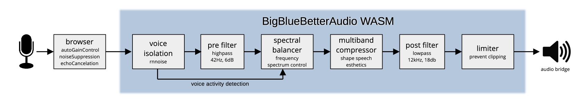

# BigBlueBetterAudio - Documentaion

BigBlueBetterAudio is a voice optimization audio processor built into a Webassembly module. It was initially developed for [BigBlueButton](https://bigbluebutton.org/), but it can be used in any web-audio context. It reduces background noise and smoothes the vocal sound. The design of the audio process is based on two decades experience as a music producer and mastering engineer.

## Faust

BBBA's DSP is written in [Faust](https://faust.grame.fr/) and compiled to a wasm module via DPF and emscripten.


For voice isolation, BBBA uses [RNNoise](https://github.com/xiph/rnnoise), a popular voice isolation machine learning process.

## WASM

From their [website](https://webassembly.org/):

WebAssembly (abbreviated *Wasm*) is a binary instruction format for a stack-based virtual machine. Wasm is designed as a portable compilation target for programming languages, enabling deployment on the web for client and server applications.

## Audio Flow



BBBA works best when the following audioConstraints are applied by the browser:
```
autoGainControl : true
noiseSuppression : true
echoCancellation : true
```


### RNNoise Voice Isolation

RNNoise is a noise suppression library based on a recurrent neural network.

A description of the algorithm is provided in the following [paper](https://arxiv.org/pdf/1709.08243.pdf):

J.-M. Valin, A Hybrid DSP/Deep Learning Approach to Real-Time Full-Band Speech Enhancement, Proceedings of IEEE Multimedia Signal Processing (MMSP) Workshop, arXiv:1709.08243, 2018.

### Pre Gain

A simple gain / attenuator control to adjust the input level of the audio. It ranges from -20dB to +20dB

### Highpass Filter

A 6dB fixed highpass filter at 42Hz to get rid of any subsonic or DC content.

### Crossover

Linkwitz-Riley 4th-order 8-way crossover.

Crossover frequencies are (Hz): 100,200,400,800,1600,3200,6400

### Spectral Balancer

A custom built DSP process to smooth the frequency spectrum of the audio. Simply put, it makes thin voices sound warmer and dull voices fresher. And everything in between.

Each of the 8 frequency bands's loudness is continuously compared to the loudness of the full range signal. This results in a temporary loudness-normalised frequency curve of the audio. This curve is compared to a predefined target curve and the loudness of the bands is nudged to its direction.

These adjustments are carefully time-smoothed and only applied when voice activity is detected by RNNoise.

The spectral balancer process results in a smoothed out frequency responce of any incoming voices.

### Multiband Compressor

The 8 frequency bands are passed on to a custom coded 8-band multiband compressor which shapes the audio aesthetically which result in a smoother sound.

The time constants and values are carefully chosen to provide a consistent but natural vocal sound.

The bands are recombined to a mono signal.

### Lowpass Filter

A 18dB fixed lowpass filter at 12kHz to roll off any ultra high audio content which is not needed for speech and could cause artifacts in data compression.

### Post Gain

A simple gain / attenuator control to adjust the output level of the audio. It ranges from -20dB to +20dB

### Lookahead Limiter

A safety lookahead limiter to protect the audio from clipping on the output. Output ceiling is -1dbfs, lookahead time is 10ms.

## Parameters

A set of parameters can be sent to the wasm:

- intensity (in %,  0 to 100)  
specifies the intensity of RNNoise voice isolation. It’s basically a dry/wet control mixing the original signal and the isolated signal.  
While 100% is impressive and reduces background noise to the max, 90% can sound more natural sometimes, leaving some of the room atmosphere intact.

- `leveler_target` (in dB, -60 to 0)  
specifies the base threshold for the multiband compressor.

- `sb_strength` (in %,  0 to 100)  
specifies the strength or intensity of the spectral balancer

- `mb_strength` (in %,  0 to 100)  
specifies the strength or intensity of the multiband compressor

- `pre_gain` (in dB, -20 to 20)  
adjusts the input gain

- `post_gain` (in dB, -20 to 20)  
adjusts the output gain pre limiter

The default values are set to match a nice interaction with incoming signals which have been leveled by the browser’s audioConstraint autoGainControl.

## Integration

### Web Demo

We created a web demo implementation here: [https://bbba.4ohm.de](https://bbba.4ohm.de/)

Here is the [code](https://github.com/trummerschlunk/BigBlueBetterAudio/tree/main/web).

### BigBlueButton

See our [BBB fork](https://github.com/trummerschlunk/bigbluebutton) and [PR](https://github.com/bigbluebutton/bigbluebutton/pull/24268) for how we injected it into BBB.

### LaSuite Meet (visio)

See our [PR](https://github.com/suitenumerique/meet/pull/1015) for how we injected it into LaSuite Meet.
